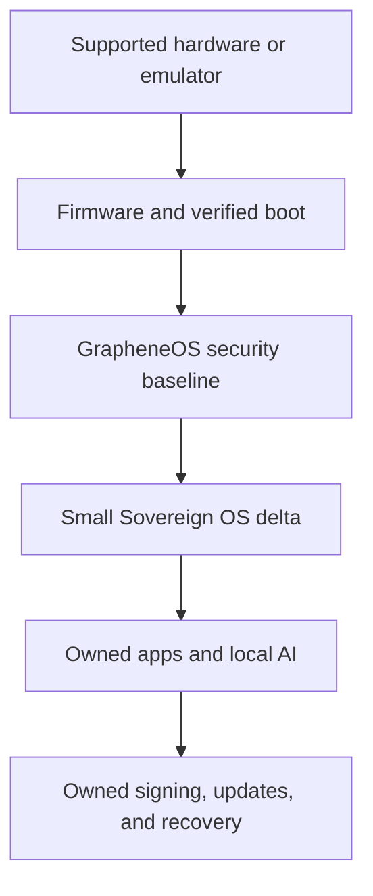

# Architecture

## Goal

Build sovereignty as a chain of controlled, inspectable layers without weakening the security properties inherited from GrapheneOS. “Sovereign” means the operator can understand, reproduce, sign, deploy, update, and recover the parts claimed as controlled. It does not mean every transistor, firmware image, network, or upstream dependency is already self-produced.

Security flows upward: an application cannot repair a broken boot chain, and a custom interface is not useful if updates are late. Work therefore proceeds from verifiable foundations toward higher-level product features.

## Layers and ownership

| Layer | Initial source | What this project must own | Remaining dependency |
| --- | --- | --- | --- |
| Development target | GrapheneOS emulator, then a supported spare Pixel | Target selection, inventory, recovery procedure | CPU, device firmware, vendor support |
| Boot integrity | Android Verified Boot and supported hardware roots | Release keys, key backups, signed images, rollback policy | Boot ROM and vendor firmware |
| OS baseline | GrapheneOS on Android 17 | Patch intake, build provenance, bounded deltas | AOSP and GrapheneOS upstreams |
| Component forks | None initially | Only repositories with an intentional modification | Per-component upstreams and licenses |
| Applications | Sandboxed apps | Source, permissions, data formats, export and backup | Selected libraries and services |
| AI | Not yet selected | Model provenance, local inference boundary, opt-in data flow | Model weights and compute hardware |
| Release operations | No channel yet | Offline signing, owned update endpoint, staged rollout, recovery | DNS, hosting, connectivity |
| Future hardware | Commercial development hardware | Requirements, schematics, firmware policy, test fixtures | Fabrication and component supply chain |

## Repository strategy

The Android source tree contains hundreds of Git repositories. This manifest fork coordinates them; it is not a monorepo.

- Keep `17` byte-for-byte aligned with the upstream development branch.
- Use `sovereign-17` for integration policy and manifest overlays.
- Initially consume GrapheneOS and AOSP repositories at the revisions selected by upstream.
- Fork a component only when a reviewed change is ready.
- Replace that one project through a local manifest overlay, preserving the same source path.
- Track the fork's upstream remote and keep its delta measurable.
- Resolve every release to immutable commit hashes with `repo manifest -r`.

`default.xml` is generated by GrapheneOS's `adevtool`. Direct ad-hoc edits would be fragile, so the first customization mechanism is an explicit local manifest under `sovereign/local_manifests/`. Once the derivative has enough real overrides to justify its own generator configuration, that decision can be revisited.

## Initial trust boundaries

1. **Upstream intake:** upstream code is reviewed and pinned; GitHub state alone is not a release attestation.
2. **Build host:** source compilation happens on a dedicated, patched host with recorded inputs.
3. **Signing boundary:** private release keys never live in this repository or on the online build host.
4. **Update boundary:** custom builds use an operator-controlled update endpoint and staged channels.
5. **Device boundary:** experimentation starts in an emulator, then moves to a spare supported device.
6. **Secret boundary:** a daily-use phone is not the sole custodian of high-value root secrets or wallet recovery material.

## First architectural decision

The first bootable artifact will contain no Sovereign OS code changes. Its purpose is to validate the build host, source resolution, build commands, emulator workflow, and provenance record. A baseline that cannot be reproduced is not a safe base for customization.
